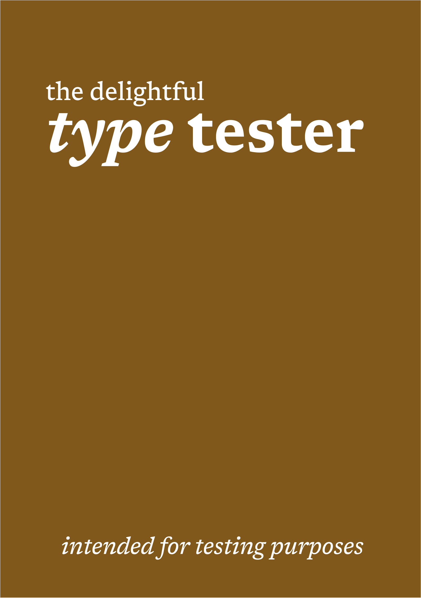

# Trevelyan's Type Tester

<p align="center">
  
</p>

**Trevelyan's Type Tester** is a short typographic novella set at Trevelyan & Co., where Tanya designs typefaces, sets books, and reads the occasional manuscript that matters. What began as an EPUB test book gradually became a quiet narrative about readability, judgment, spacing, and the mechanics of reading well.

## What's in this repo?

### The pipeline

This repository holds the editable source for the book, plus the small build pipeline that produces two downloadable versions of the book:

- *Trevelyan's Type Tester.epub* (Regular epub)
- *Trevelyan's Type Tester.kepub.epub* (Kobo epub)

### Source package

The source EPUB package lives under `src/`, with XHTML chapters, metadata, navigation documents, styles, cover assets, and embedded fonts all stored in the structure expected by the final book.

## Build

Run:

```bash
./build.sh
```

The build script will:

1. Build the EPUB package.
2. Run `epubcheck` if it is installed.
3. Generate a KEPUB variant if `kepubify` is installed.

## Typography Notes

The book currently relies on the reading system’s serif font rather than an embedded typeface. The source chapters also include a collected appendix of the typographic references, specimen grids, poem sample, and dialogue sample used throughout the novella.

The point of this `epub` (or `kepub`) is that you can use it to validate fonts included or sideloaded on your device.

## Credits

This edition is assembled by Nico Verbruggen (an alias is used in the actual epub for my own amusement).

## License

This edition is released into the public domain.
